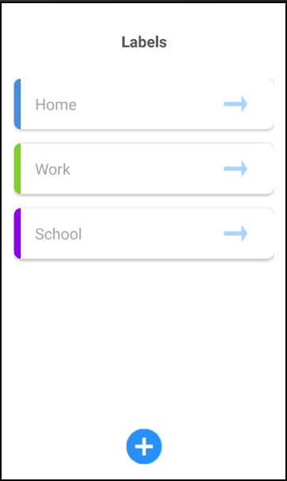
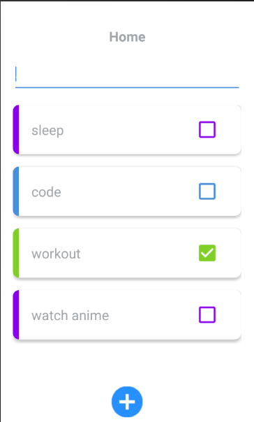

# JetTodoList

A simple todo app, representing my journey in learning android as well as my first implementation of my own API : [JetTodoApi](https://github.com/oussamabonnor1/ASP.Net-Core-Web-API).

## Screenshots:

  

## Tools used:
* Android studio (IDE)
* Java (logic)
* XML (design)
* Paint.Net (Image editting)

## TODO:

- [ ] Make the API call on different thread than the UI main thread.
- [ ] Adding better way to add todo items (UI/UX speaking).
- [ ] adding possibility to create custom tables.

## Contributing

Feel free to `fork` this project and add whatever you like (Helping with the TODOs would be amazing tho). If you have any suggestions or any comments please feel free to contact me or to open an issue.

## Team:
[Jetlighters](https://github.com/JetLightStudio) having fun.
